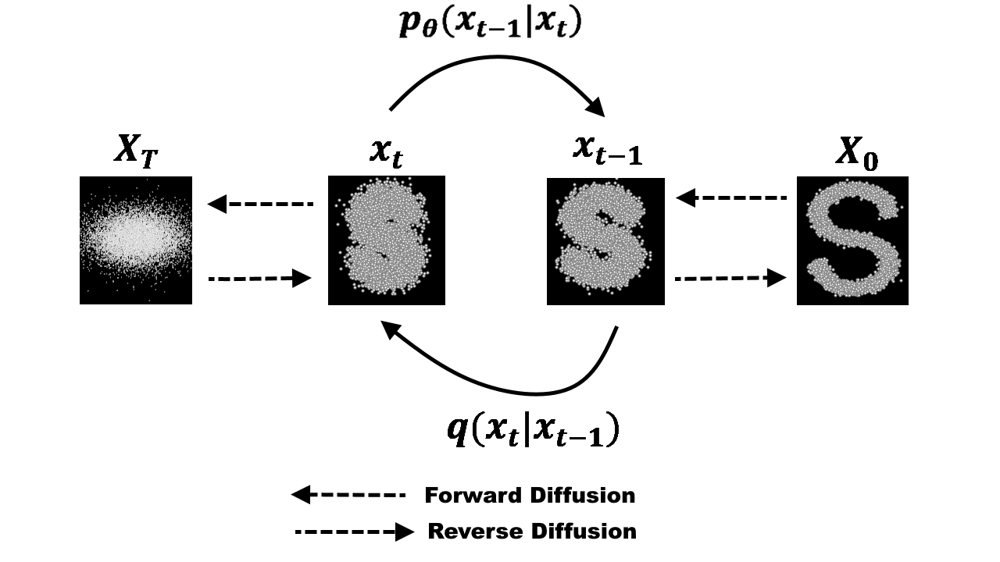

# Imitating AI(모창 인공지능)
> 2023년 2학년 프로젝트

## Tech
- Diff-SVC(Diffusion 기반)

Diffusion 모델은 이미지 생성하는 딥러닝 모델이다.

- <h3>하지만 음성의 파형도 잘 보면 이미지로 인식 할 수 있다.</h3>

[https://r9y9.github.io/projects/nnsvs/](https://r9y9.github.io/projects/nnsvs/)  
위 링크를 보면 Diffusion학습이 다른 학습 방법들로 학습하였을 떄 보다 훨씬 깔끔한 소리를 보여준다.
 